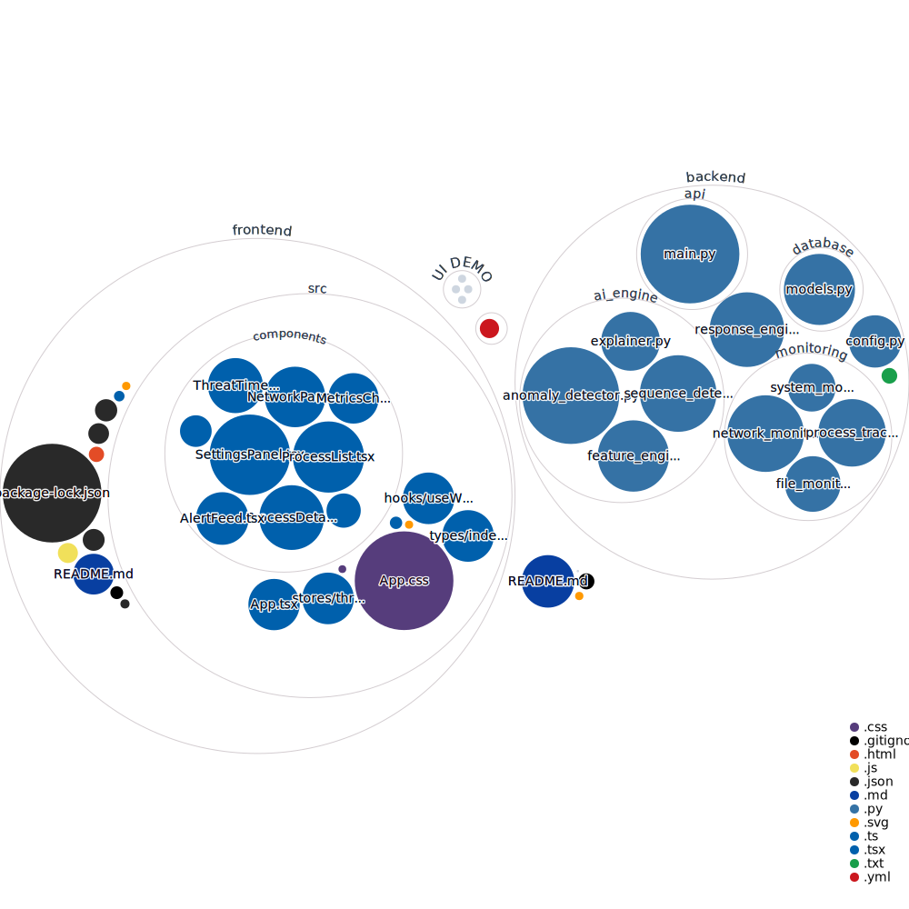

# Auraveil 🛡️  
**AI-Powered, Privacy-First Behavioral Security for Personal Devices**

Auraveil is an on-device cybersecurity system that detects threats by **how software behaves**, not by known malware signatures.  
It is designed for personal devices, prioritizing **early threat detection, transparency, and user privacy**.

> If software lies, behavior doesn't.

---

## 📊 Codebase Visualization

> This diagram is auto-generated on every push to `main` using the [GitHub Repo Visualizer](https://github.com/githubocto/repo-visualizer). Each circle represents a file or folder — color indicates file type, size indicates file size.

---

## 🚀 What Auraveil Does

Auraveil continuously monitors system activity and uses behavioral analysis to:
- Detect unknown and zero-day threats
- Identify ransomware activity before major damage
- Flag stealthy background malware
- Operate fully offline with **zero cloud dependency**

All analysis happens **locally on the user's device**.

---

## 🎯 Key Features

### 🧠 Behavioral Threat Detection
- Learns normal system behavior per device
- Detects anomalies without relying on malware signatures
- Works against zero-day and fileless attacks

### 🔍 Real-Time Monitoring
- Process creation and lifecycle
- CPU, memory, disk, and file access behavior
- Continuous low-overhead background monitoring

### 🚨 Threat Scoring & Response
- Risk score per process (Safe / Suspicious / Malicious)
- User alerts with clear explanations
- Manual and automatic response options

### 🔐 Privacy-First by Design
- Fully on-device execution
- No telemetry or user data sent externally
- No cloud services required

### 📊 User Dashboard
- Live system activity view
- Process-level threat scores
- Alert history with explanations
- User control over actions

---

## 🧩 Architecture Overview

Auraveil is built as a modular system:

1. **Monitoring Layer** – Collects real-time system behavior  
2. **Behavior Analysis Engine** – Learns baselines and detects anomalies  
3. **Threat Scoring Engine** – Assigns risk levels to processes  
4. **Response & Control Layer** – Alerts or intervenes based on severity  
5. **User Dashboard** – Transparency and manual control  

All components run locally on the user's device.

---

## 🖥️ Supported Platforms (Current)

- **Windows** (Primary)
- **Linux** (Planned / Partial)
- Device class: Personal laptops and desktops
- Optimized for AMD Ryzen systems (optional enhancements)

---

## ⚙️ Technology Stack

### Core
- **Python** – System monitoring and analysis
- **psutil** – CPU, memory, disk, and process metrics

### AI & Analysis
- **PyTorch** – Behavioral modeling
- **Scikit-learn** – Unsupervised anomaly detection

### Backend
- **FastAPI** – Local APIs
- **WebSockets** – Real-time updates
- **SQLite** – Local logs and alerts

### Frontend
- **React**
- **TypeScript**
- **Local dashboard UI**

---

## 🔧 AMD Alignment

Auraveil is designed to take advantage of AMD hardware capabilities:
- Hardware-aware behavior signals
- Fine-grained power and efficiency insights
- On-device AI execution without cloud dependency

All AMD-specific features are **optional** and fail gracefully on other platforms.

---

## 🧪 Project Status

- ✅ MVP implemented
- ✅ Real-time monitoring & dashboard
- ✅ Behavioral threat scoring
- 🔄 Ongoing tuning & hardening

This repository represents an **actively developed prototype**, not a production antivirus.

---

## 📂 Repository Structure (Planned)
auraveil/

---

## 🛑 Non-Goals (By Design)

Auraveil is NOT:
- A signature-based antivirus
- A cloud-dependent security product
- An enterprise EDR replacement
- A kernel-driver heavy solution (for MVP)

---

## 🧭 Roadmap (High-Level)

- Improve anomaly detection accuracy
- Cross-platform support (Windows / Linux / macOS)
- Enhanced explainability
- Optional federated learning (privacy-preserving)
- Extended AMD hardware optimizations

---

## 🤝 Contributing

Auraveil is built with an open, security-first mindset.

Contributions, testing, and feedback are welcome:
- Bug reports
- Performance testing
- UX improvements
- Security research insights

---

## 🧠 Philosophy

Auraveil is built around one idea:

> **Enterprise-grade security should not require enterprise budgets or sacrificing privacy.**

---

*Auraveil — stopping threats before damage occurs.*
